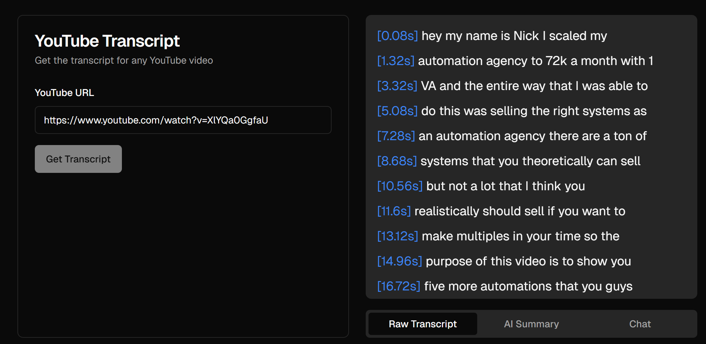
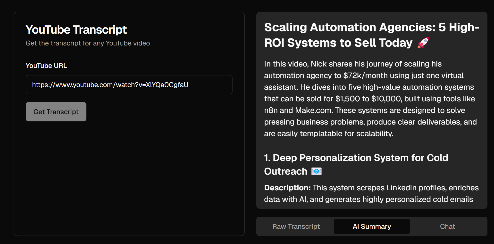
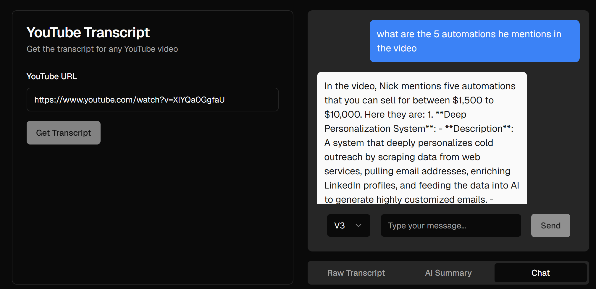

# Slipstream - YouTube Transcript Intelligence Platform

A Next.js + Supabase application that extracts YouTube video transcripts, provides AI-powered analysis, and enables persistent, multi-video insights with advanced LLM features.

---

## Vision

Transform YouTube content into a searchable, organized, and insightful knowledge base powered by AI.  
Save, analyze, and revisit transcripts, summaries, and conversations — across single videos or entire collections.  
Leverage AI to uncover themes, generate meta-summaries, and gain deep insights from your video library.

---

## Current Features

- **Transcript Extraction**: Get full transcripts from YouTube videos  
  {: width="600"}  
  _Raw transcript display with clickable timestamps_

- **AI Summarization**: Generate structured summaries with:  
  {: width="600"}  
  _Overview, key points, examples, and HTML-formatted output_

- **Interactive Chat**: Ask questions about the video content  
  {: width="600"}  
  _Chat interface with conversation history_

- **Multiple AI Models**:
  - Llama 4 Scout (OpenRouter)
  - Gemini 2.5 Flash
  - Optimus Alpha

---

## Upcoming Enhancements

- **Persistent Storage with Supabase**: Auto-save transcripts, summaries, and chats
- **Saved Video Library**: Search, filter, tag, and organize past videos
- **Multi-Video Summarizer**: Select multiple videos to generate a combined "Meta Summary" (Insight Fusion, ThemeSynth, etc.)
- **Dashboard & Analytics**: Visualize your activity, usage stats, and insights
- **Smart Tagging & Semantic Search**: AI-powered tagging and vector search
- **Topic Clustering**: Group videos by themes using embeddings
- **AI Highlights & Export**: Extract key moments, export insights, and share
- **Sidebar Navigation**: Intuitive UI with ShadCN components

See [docs/enhancement-plan.md](./docs/enhancement-plan.md) for the full roadmap.

---

## How It Works

1. Enter a YouTube video URL
2. View the full transcript with clickable timestamps
3. Use AI features:
   - Generate summaries
   - Chat with the video content
4. Save and organize your videos
5. Explore insights across multiple videos

---

## Tech Stack

- **Frontend**: Next.js, TypeScript, Tailwind CSS, ShadCN UI
- **Backend**: Supabase (Postgres, Auth, Storage)
- **AI Providers**: OpenRouter, Groq, Gemini, Optimus Alpa
- **Other**: pgvector (semantic search), React charting libraries

---

## Setup

1. Clone the repository
2. Install dependencies: `npm install`
3. Set up environment variables (API Keys, Supabase URL & Key)
4. Run the development server: `npm run dev`

---

## Usage

1. Start the app
2. Enter a YouTube URL
3. Explore transcripts, summaries, and chat
4. Save and organize videos
5. Run multi-video insights and view analytics

---

## Contributing

Contributions welcome!  
Please open an issue or submit a pull request to help improve this platform.
