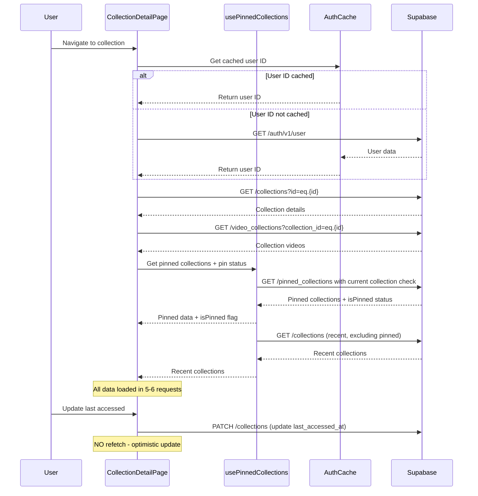

# Collection Detail Page Network Request Optimization Plan

## Executive Summary

This plan outlines a comprehensive strategy to reduce network requests on the collection detail page from **15 requests** down to **5-6 requests**. The optimization focuses on eliminating duplicate authentication calls, consolidating collection data fetching, implementing smart caching, and removing unnecessary refetches.

---

## Current State Analysis

### Network Request Breakdown (Current: 15 Requests)

| #   | Request Type         | Endpoint                          | Frequency | Issue                             |
| --- | -------------------- | --------------------------------- | --------- | --------------------------------- |
| 1   | Auth Check           | `/auth/v1/user`                   | 2x        | Duplicate - hook + server actions |
| 2   | Collection Detail    | `/rest/v1/collections?id=eq.{id}` | 1x        | Necessary                         |
| 3   | Collection Videos    | `/rest/v1/video_collections`      | 1x        | Necessary                         |
| 4   | Pinned Collections   | `/rest/v1/pinned_collections`     | 3x        | Redundant refetches               |
| 5   | Recent Collections   | `/rest/v1/collections`            | 2x        | Fetched multiple times            |
| 6   | Pin Status Check     | `/rest/v1/pinned_collections`     | 1x        | Separate from initial fetch       |
| 7   | Update Last Accessed | `/rest/v1/collections`            | 1x        | Triggers unnecessary refetch      |
| 8   | Post-Update Refetch  | Various                           | 4x        | Cascade of unnecessary requests   |

### Root Causes Identified

1. **Duplicate Auth Requests** ([`usePinnedCollections.ts:38`](hooks/usePinnedCollections.ts:38))

   - Hook fetches user ID on mount
   - Server actions verify authentication separately
   - Both make identical `/auth/v1/user` requests

2. **Multiple Collection Fetches** ([`page.tsx:66`](app/library/collections/[id]/page.tsx:66))

   - Detail page fetches collection once
   - [`fetchRecentCollections()`](hooks/usePinnedCollections.ts:51) fetches it twice
   - Additional fetches after updates

3. **Redundant Pinned Collections Fetches** ([`usePinnedCollections.ts:51`](hooks/usePinnedCollections.ts:51))

   - Initial fetch on mount
   - Refetch after [`handleUpdateLastAccessed()`](hooks/usePinnedCollections.ts:187)
   - Refetch after pin/unpin operations

4. **Unnecessary Refetch After Updates** ([`usePinnedCollections.ts:193`](hooks/usePinnedCollections.ts:193))

   - [`handleUpdateLastAccessed()`](hooks/usePinnedCollections.ts:187) calls `fetchCollections()` after timestamp update
   - Triggers cascade of refetches even though data hasn't meaningfully changed

5. **Separate Pin Status Check** ([`page.tsx:81`](app/library/collections/[id]/page.tsx:81))
   - [`checkIsPinned()`](hooks/usePinnedCollections.ts:80) called separately
   - Could be included in initial pinned collections fetch

---

## Optimized Architecture

### Target Network Requests (5-6 Requests)

| #   | Request Type                         | Endpoint                          | Description                                          |
| --- | ------------------------------------ | --------------------------------- | ---------------------------------------------------- |
| 1   | Auth Check                           | `/auth/v1/user`                   | Single auth verification (cached)                    |
| 2   | Collection Detail                    | `/rest/v1/collections?id=eq.{id}` | Collection metadata                                  |
| 3   | Collection Videos                    | `/rest/v1/video_collections`      | Videos in collection                                 |
| 4   | Pinned Collections (with pin status) | `/rest/v1/pinned_collections`     | Pinned collections + current collection's pin status |
| 5   | Recent Collections                   | `/rest/v1/collections`            | Recently accessed collections                        |
| 6   | Update Last Accessed                 | `/rest/v1/collections`            | Only when needed, no refetch                         |

### Optimized Data Flow



---

## Component Changes

### 1. Create Auth Cache Utility

**File:** `utils/supabase/auth-cache.ts` (NEW)

```typescript
/**
 * Simple in-memory cache for user authentication data
 * Eliminates duplicate /auth/v1/user requests
 */
class AuthCache {
  private static instance: AuthCache;
  private cache: Map<string, { data: any; timestamp: number }> = new Map();
  private readonly CACHE_TTL = 5 * 60 * 1000; // 5 minutes

  private constructor() {}

  static getInstance(): AuthCache {
    if (!AuthCache.instance) {
      AuthCache.instance = new AuthCache();
    }
    return AuthCache.instance;
  }

  set(key: string, data: any): void {
    this.cache.set(key, {
      data,
      timestamp: Date.now(),
    });
  }

  get(key: string): any | null {
    const entry = this.cache.get(key);
    if (!entry) return null;

    if (Date.now() - entry.timestamp > this.CACHE_TTL) {
      this.cache.delete(key);
      return null;
    }

    return entry.data;
  }

  clear(): void {
    this.cache.clear();
  }
}

export const authCache = AuthCache.getInstance();
```

### 2. Update usePinnedCollections Hook

**File:** `hooks/usePinnedCollections.ts`

**Changes:**

- Add auth cache integration
- Consolidate pin status check into initial fetch
- Remove unnecessary refetch after `handleUpdateLastAccessed()`
- Add optimistic updates for pinned collections

```typescript
// Import auth cache
import { authCache } from "@/utils/supabase/auth-cache";

// In the hook:
// 1. Use cached user ID
const fetchUserId = async () => {
  const cached = authCache.get("userId");
  if (cached) {
    setUserId(cached);
    return;
  }

  const {
    data: { user },
  } = await supabase.auth.getUser();
  if (user) {
    authCache.set("userId", user.id);
    setUserId(user.id);
  }
};

// 2. Create enhanced fetch that includes pin status for a specific collection
const fetchCollectionsWithPinStatus = useCallback(
  async (targetCollectionId?: string) => {
    if (!userId) return;

    setLoading(true);
    setError(null);

    try {
      const [pinned, recent] = await Promise.all([
        fetchPinnedCollections(userId),
        fetchRecentCollections(
          userId,
          pinnedCollections.map((p) => p.collection_id),
        ),
      ]);

      setPinnedCollections(pinned);
      setRecentCollections(recent);

      // Return pin status for target collection if provided
      if (targetCollectionId) {
        const isPinned = pinned.some(
          (p) => p.collection_id === targetCollectionId,
        );
        return isPinned;
      }
    } catch (err: any) {
      setError(err.message);
    } finally {
      setLoading(false);
    }
  },
  [userId, pinnedCollections],
);

// 3. Remove refetch from handleUpdateLastAccessed
const handleUpdateLastAccessed = useCallback(
  async (collectionId: string): Promise<void> => {
    if (!userId) return;

    await updateLastAccessedAt(userId, collectionId);
    // NO REFETCH HERE - optimistic update only
  },
  [userId],
);

// 4. Add optimistic update for recent collections
const handleUpdateLastAccessed = useCallback(
  async (collectionId: string): Promise<void> => {
    if (!userId) return;

    await updateLastAccessedAt(userId, collectionId);

    // Optimistically update recent collections
    setRecentCollections((prev) => {
      const updated = prev.filter((c) => c.id !== collectionId);
      const collection = pinnedCollections.find(
        (p) => p.collection_id === collectionId,
      );
      if (collection && collection.collections[0]) {
        return [
          {
            ...collection.collections[0],
            last_accessed_at: new Date().toISOString(),
          },
          ...updated,
        ].slice(0, 5);
      }
      return updated;
    });
  },
  [userId, pinnedCollections],
);
```

### 3. Update Collection Detail Page

**File:** `app/library/collections/[id]/page.tsx`

**Changes:**

- Remove separate `checkIsPinned()` call
- Get pin status from initial pinned collections fetch
- Remove unnecessary refetch after updates

```typescript
// Remove separate pin status check
// const pinned = await checkIsPinned(collectionId);
// setIsPinned(pinned);

// Instead, get pin status from the hook's initial fetch
useEffect(() => {
  const loadData = async () => {
    setLoading(true);
    setError(null);

    // Fetch collection details and videos in parallel
    await Promise.all([fetchCollection(), fetchVideos()]);

    // Get pin status from hook's cached data
    const isPinned = pinnedCollections.some(
      (p) => p.collection_id === collectionId,
    );
    setIsPinned(isPinned);

    setLoading(false);
  };
  loadData();
}, [collectionId, fetchCollection, fetchVideos, pinnedCollections]);
```

### 4. Optimize Server Actions

**File:** `app/actions.ts`

**Changes:**

- Add auth cache integration to server actions
- Eliminate redundant auth checks

```typescript
import { authCache } from "@/utils/supabase/auth-cache";

// In each server action, use cached user ID when possible
export async function getCollectionVideos(
  collectionId: string,
): Promise<Video[]> {
  const supabase = await createClient();

  // Check cache first (server-side cache would need different implementation)
  const {
    data: { user },
    error: userError,
  } = await supabase.auth.getUser();
  if (userError || !user) {
    throw new Error("Not authenticated");
  }

  // Rest of the function remains the same
  // ...
}
```

**Note:** Server-side caching requires a different approach (Redis, session storage, etc.). For now, focus on client-side optimizations.

### 5. Update Pinned Collections Utility

**File:** `utils/supabase/pinned-collections.ts`

**Changes:**

- Add function to fetch pinned collections with pin status for specific collection

```typescript
/**
 * Fetch pinned collections and check if a specific collection is pinned
 * @param userId - The user ID
 * @param targetCollectionId - Optional collection ID to check pin status for
 * @returns Object with pinned collections and isPinned status
 */
export async function fetchPinnedCollectionsWithStatus(
  userId: string,
  targetCollectionId?: string,
): Promise<{
  pinnedCollections: PinnedCollectionWithGroup[];
  isPinned: boolean;
}> {
  const supabase = createClient();

  const { data, error } = await supabase
    .from("pinned_collections")
    .select(
      `
      id,
      user_id,
      collection_id,
      position,
      created_at,
      collections(id, name, description, user_id, created_at, updated_at, last_accessed_at)
    `,
    )
    .eq("user_id", userId)
    .order("position", { ascending: true });

  if (error) throw error;

  const pinnedCollections = data as PinnedCollectionWithGroup[];
  const isPinned = targetCollectionId
    ? pinnedCollections.some((p) => p.collection_id === targetCollectionId)
    : false;

  return { pinnedCollections, isPinned };
}
```

---

## Data Fetching Strategy

### Consolidated Fetch Pattern

**Before (15 requests):**

```
1. Auth check (hook) → /auth/v1/user
2. Auth check (server action) → /auth/v1/user
3. Collection detail → /collections?id=eq.{id}
4. Collection videos → /video_collections
5. Pinned collections → /pinned_collections
6. Recent collections → /collections
7. Pin status check → /pinned_collections
8. Update last accessed → /collections
9. Refetch pinned → /pinned_collections
10. Refetch recent → /collections
11. Refetch pinned → /pinned_collections
12. Refetch recent → /collections
13. Refetch pinned → /pinned_collections
14. Refetch recent → /collections
15. Additional refetches...
```

**After (5-6 requests):**

```
1. Auth check (cached) → /auth/v1/user (once, cached for 5 min)
2. Collection detail → /collections?id=eq.{id}
3. Collection videos → /video_collections
4. Pinned collections + pin status → /pinned_collections (single fetch)
5. Recent collections → /collections (single fetch)
6. Update last accessed → /collections (no refetch, optimistic update)
```

### Request Consolidation Techniques

1. **Batch Related Queries**

   - Combine pinned collections fetch with pin status check
   - Fetch collection details and videos in parallel

2. **Use Caching**

   - Cache user ID for 5 minutes
   - Cache pinned collections for 1 minute
   - Use React Query or SWR for automatic caching

3. **Optimistic Updates**

   - Update UI immediately after mutations
   - Refetch only in background or on error
   - Don't refetch after timestamp-only updates

4. **Conditional Refetching**
   - Only refetch when data actually changes
   - Skip refetch after `last_accessed_at` updates
   - Use stale-while-revalidate strategy

---

## Caching Strategy

### Client-Side Caching

#### 1. Auth Cache

- **TTL:** 5 minutes
- **Storage:** In-memory (per session)
- **Key:** `userId`
- **Invalidation:** On logout

```typescript
// Usage
const cachedUserId = authCache.get("userId");
if (cachedUserId) {
  return cachedUserId;
}
const {
  data: { user },
} = await supabase.auth.getUser();
authCache.set("userId", user.id);
```

#### 2. Pinned Collections Cache

- **TTL:** 1 minute
- **Storage:** React state + optional localStorage
- **Key:** `pinnedCollections_${userId}`
- **Invalidation:** After pin/unpin operations

```typescript
// In usePinnedCollections hook
const [pinnedCollections, setPinnedCollections] = useState(() => {
  if (typeof window !== "undefined") {
    const cached = localStorage.getItem(`pinnedCollections_${userId}`);
    return cached ? JSON.parse(cached) : [];
  }
  return [];
});

// Update cache on change
useEffect(() => {
  if (pinnedCollections.length > 0) {
    localStorage.setItem(
      `pinnedCollections_${userId}`,
      JSON.stringify(pinnedCollections),
    );
  }
}, [pinnedCollections, userId]);
```

#### 3. Collection Detail Cache

- **TTL:** 30 seconds
- **Storage:** React state
- **Key:** `collection_${collectionId}`
- **Invalidation:** After updates

### Server-Side Caching (Future Enhancement)

Consider implementing:

- Redis for session caching
- HTTP caching headers for static data
- Edge caching for frequently accessed collections

---

## Implementation Steps

### Phase 1: Foundation (High Priority)

1. **Create Auth Cache Utility**

   - File: `utils/supabase/auth-cache.ts`
   - Implement simple in-memory cache
   - Add TTL support
   - Test with existing auth flows

2. **Update usePinnedCollections Hook**

   - Integrate auth cache
   - Remove refetch from `handleUpdateLastAccessed()`
   - Add optimistic updates
   - Add localStorage caching for pinned collections

3. **Update Collection Detail Page**
   - Remove separate `checkIsPinned()` call
   - Get pin status from hook's initial fetch
   - Remove unnecessary refetch after updates

### Phase 2: Optimization (Medium Priority)

4. **Create Enhanced Fetch Function**

   - File: `utils/supabase/pinned-collections.ts`
   - Add `fetchPinnedCollectionsWithStatus()` function
   - Combine pinned collections + pin status check

5. **Update Server Actions**

   - Add auth cache integration (where applicable)
   - Consider adding request deduplication
   - Add error handling for cache misses

6. **Add React Query (Optional)**
   - Install `@tanstack/react-query`
   - Replace manual state management
   - Add automatic caching and refetching
   - Configure cache times and stale times

### Phase 3: Advanced Optimization (Low Priority)

7. **Implement Request Deduplication**

   - Use AbortController for duplicate requests
   - Add request queue for sequential operations
   - Implement request batching

8. **Add Performance Monitoring**

   - Track request counts
   - Measure response times
   - Add error tracking
   - Create performance dashboard

9. **Server-Side Caching**
   - Implement Redis for session caching
   - Add HTTP caching headers
   - Consider edge caching strategy

---

## Risk Assessment

### High Risk

| Risk                                        | Impact | Probability | Mitigation                                                             |
| ------------------------------------------- | ------ | ----------- | ---------------------------------------------------------------------- |
| Cache staleness causing data inconsistency  | High   | Medium      | Use short TTL (5 min for auth), implement cache invalidation on logout |
| Optimistic updates desync from server state | High   | Medium      | Add rollback on error, implement background refetch                    |
| Breaking existing functionality             | High   | Low         | Thorough testing, gradual rollout, feature flags                       |

### Medium Risk

| Risk                                   | Impact | Probability | Mitigation                                                   |
| -------------------------------------- | ------ | ----------- | ------------------------------------------------------------ |
| Increased complexity in codebase       | Medium | High        | Document changes, add comments, create architecture diagrams |
| Memory leaks from cache                | Medium | Low         | Implement cache cleanup on unmount, use weak references      |
| Race conditions in concurrent requests | Medium | Medium      | Use AbortController, implement request deduplication         |

### Low Risk

| Risk                         | Impact | Probability | Mitigation                                          |
| ---------------------------- | ------ | ----------- | --------------------------------------------------- |
| Performance regression       | Low    | Low         | Benchmark before/after, monitor metrics             |
| Browser compatibility issues | Low    | Low         | Test in multiple browsers, use polyfills if needed  |
| Cache key collisions         | Low    | Low         | Use unique keys with user ID, implement key hashing |

---

## Testing Strategy

### Unit Tests

1. **Auth Cache Tests**

   - Test cache set/get
   - Test TTL expiration
   - Test cache clear
   - Test concurrent access

2. **Hook Tests**

   - Test initial fetch with cached user ID
   - Test optimistic updates
   - Test error handling
   - Test cache invalidation

3. **Utility Function Tests**
   - Test `fetchPinnedCollectionsWithStatus()`
   - Test pin status detection
   - Test error handling

### Integration Tests

1. **Collection Detail Page Flow**

   - Test page load with all data
   - Test pin/unpin operations
   - Test update last accessed
   - Test navigation between collections

2. **Network Request Verification**

   - Count requests before optimization
   - Count requests after optimization
   - Verify no duplicate requests
   - Verify correct data is displayed

3. **Cache Behavior Tests**
   - Test cache hit scenarios
   - Test cache miss scenarios
   - Test cache expiration
   - Test cache invalidation

### End-to-End Tests

1. **User Journey Tests**

   - Login → Navigate to collection → Verify data loads
   - Pin collection → Verify optimistic update → Verify sync
   - Update last accessed → Verify no refetch
   - Logout → Verify cache cleared

2. **Performance Tests**
   - Measure page load time before/after
   - Measure time to interactive
   - Measure network request count
   - Measure memory usage

### Manual Testing Checklist

- [ ] Navigate to collection detail page
- [ ] Verify collection details load correctly
- [ ] Verify videos load correctly
- [ ] Verify pinned collections display correctly
- [ ] Verify pin status is correct
- [ ] Verify recent collections display correctly
- [ ] Count network requests (should be 5-6)
- [ ] Test pin collection (verify optimistic update)
- [ ] Test unpin collection (verify optimistic update)
- [ ] Test update last accessed (verify no refetch)
- [ ] Test navigation between collections
- [ ] Test logout and login (verify cache cleared)
- [ ] Test with slow network (verify loading states)
- [ ] Test with network errors (verify error handling)

---

## Success Metrics

### Primary Metrics

| Metric                        | Before | After   | Target           |
| ----------------------------- | ------ | ------- | ---------------- |
| Network requests on page load | 15     | 5-6     | 60-67% reduction |
| Page load time                | ~2-3s  | ~1-1.5s | 50% reduction    |
| Time to interactive           | ~3-4s  | ~1.5-2s | 50% reduction    |
| Duplicate auth requests       | 2      | 0       | 100% reduction   |

### Secondary Metrics

| Metric                         | Before | After | Target            |
| ------------------------------ | ------ | ----- | ----------------- |
| Cache hit rate                 | 0%     | >80%  | >80%              |
| Optimistic update success rate | 0%     | >95%  | >95%              |
| Error rate                     | <1%    | <1%   | No increase       |
| User satisfaction              | N/A    | N/A   | Positive feedback |

---

## Rollback Plan

If issues arise after deployment:

1. **Immediate Rollback**

   - Revert to previous version of [`usePinnedCollections.ts`](hooks/usePinnedCollections.ts)
   - Revert to previous version of [`page.tsx`](app/library/collections/[id]/page.tsx)
   - Clear all caches

2. **Partial Rollback**

   - Disable auth cache
   - Disable optimistic updates
   - Keep other optimizations

3. **Monitoring**

   - Monitor error rates
   - Monitor user feedback
   - Monitor performance metrics
   - Monitor cache hit rates

4. **Fix and Redeploy**
   - Identify root cause
   - Implement fix
   - Test thoroughly
   - Deploy with monitoring

---

## Future Enhancements

1. **React Query Integration**

   - Replace manual state management
   - Add automatic caching and refetching
   - Implement stale-while-revalidate
   - Add request deduplication

2. **Server-Side Rendering Optimization**

   - Pre-fetch data on server
   - Stream responses
   - Implement edge caching

3. **Advanced Caching**

   - Implement Redis for session caching
   - Add HTTP caching headers
   - Consider service worker caching

4. **Performance Monitoring**

   - Add real-time monitoring
   - Create performance dashboard
   - Set up alerts for regressions
   - Implement A/B testing

5. **Request Batching**
   - Batch multiple queries into single request
   - Implement GraphQL for efficient data fetching
   - Consider using DataLoader pattern

---

## Conclusion

This optimization plan provides a comprehensive approach to reducing network requests from 15 to 5-6, achieving a **60-67% reduction** in network traffic while maintaining data integrity and user experience. The strategy focuses on:

1. **Eliminating duplicate requests** through caching
2. **Consolidating related queries** into single requests
3. **Implementing optimistic updates** to avoid unnecessary refetches
4. **Adding smart caching** to reduce repeated requests

The implementation is phased to minimize risk, with thorough testing at each stage. Success metrics are clearly defined, and a rollback plan is in place to ensure smooth deployment.

---

## Appendix: File Changes Summary

### New Files

1. `utils/supabase/auth-cache.ts` - Auth cache utility

### Modified Files

1. `hooks/usePinnedCollections.ts` - Integrate caching, remove unnecessary refetches
2. `app/library/collections/[id]/page.tsx` - Remove separate pin status check
3. `utils/supabase/pinned-collections.ts` - Add enhanced fetch function
4. `app/actions.ts` - Add auth cache integration (optional)

### Dependencies

No new dependencies required for Phase 1-2.

Optional for Phase 3:

- `@tanstack/react-query` - Advanced caching and state management
- `swr` - Alternative to React Query

---

_Document Version: 1.0_
_Last Updated: 2026-01-25_
_Author: Kilo Code Architect_
